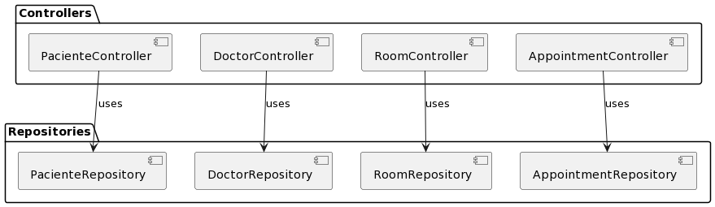

#Diagram UML

# Documentation API endpoints

# Appointment Controller
This controller manages operations related to medical appointments in the system.

- [Get All Appointments](#get-all-appointments)
- [Get an Appointment by ID](#get-an-appointment-by-id)
- [Create a New Appointment](#create-a-new-appointment)
- [Delete an Appointment by ID](#delete-an-appointment-by-id)
- [Delete All Appointments](#delete-all-appointments)

# Doctor Controller 

This controller manages operations related to doctor entities in the system

It provides endpoints for retrieving information about doctors, creating new doctor entries, and deleting existing doctor records.

- [Get All Doctors](#get-all-doctors)
- [Get Doctor by ID](#get-doctor-by-id)
- [Create a New Doctor](#create-a-new-doctor)
- [Delete Doctor by ID](#delete-doctor-by-id)
- [Delete All Doctors](#delete-all-doctors)

# Patient Controller 

This controller manages operations related to patient entities in the system.

It provides endpoints for retrieving information about patients, creating new patient entries, and deleting existing patient records.

- [Get All Patients](#get-all-patients)
- [Get Patient by ID](#get-patient-by-id)
- [Create a New Patient](#create-a-new-patient)
- [Delete Patient by ID](#delete-patient-by-id)
- [Delete All Patients](#delete-all-patients)

# Room Controller 

This controller manages operations related to room entities in the system. It provides endpoints for retrieving information about rooms, creating new room entries, and deleting existing room records.

- [Get All Rooms](#get-all-rooms)
- [Get Room by Room Name](#get-room-by-room-name)
- [Create a New Room](#create-a-new-room)
- [Delete Room by Room Name](#delete-room-by-room-name)
- [Delete All Rooms](#delete-all-rooms)

## Get All Appointments

### Endpoint
`GET /api/appointments`

### Description
Gets all medical appointments stored in the system.

### Responses
- 200 OK: Returns a list of medical appointments.
- 204 No Content: No appointments are available.

## Get an Appointment by ID

### Endpoint
`GET /api/appointments/{id}`

### Path Parameters
- `{id}`: Unique identifier of the medical appointment.

### Description
Gets a specific medical appointment by its ID.

### Responses
- 200 OK: Returns the corresponding medical appointment.
- 404 Not Found: No medical appointment found with the provided ID.

## Create a New Appointment

### Endpoint
`POST /api/appointment`

### Description
Creates a new medical appointment in the system.

### Request Body Parameters (JSON)
- `patient`: Patient information.
- `doctor`: Doctor information.
- `room`: Room information.
- `startsAt`: Date and time of the appointment start.
- `finishesAt`: Date and time of the appointment end.

### Responses
- 200 OK: The medical appointment is successfully created, and the updated list of appointments is returned.
- 400 Bad Request: The start and end date of the appointment are the same.
- 406 Not Acceptable: Schedule conflict with existing appointments.

## Delete an Appointment by ID

### Endpoint
`DELETE /api/appointments/{id}`

### Path Parameters
- `{id}`: Unique identifier of the medical appointment.

### Description
Deletes a specific medical appointment by its ID.

### Responses
- 200 OK: The medical appointment is successfully deleted.
- 404 Not Found: No medical appointment found with the provided ID.

## Delete All Appointments

### Endpoint
`DELETE /api/appointments`

### Description
Deletes all medical appointments from the system.

### Responses
- 200 OK: All medical appointments are successfully deleted.

## Get All Doctors

### Endpoint
`GET /api/doctors`

### Description
Gets all doctors stored in the system.

### Responses
- 200 OK: Returns a list of doctors.
- 204 No Content: No doctors are available.

## Get Doctor by ID

### Endpoint
`GET /api/doctors/{id}`

### Path Parameters
- `{id}`: Unique identifier of the doctor.

### Description
Gets a specific doctor by their ID.

### Responses
- 200 OK: Returns the information of the specified doctor.
- 404 Not Found: No doctor found with the provided ID.

## Create a New Doctor

### Endpoint
`POST /api/doctor`

### Description
Creates a new doctor in the system.

### Request Body Parameters (JSON)
- `firstName`: First name of the doctor.
- `lastName`: Last name of the doctor.
- `age`: Age of the doctor.
- `email`: Email of the doctor.

### Responses
- 201 Created: The doctor is successfully created, and the doctor's information is returned.

## Delete Doctor by ID

### Endpoint
`DELETE /api/doctors/{id}`

### Path Parameters
- `{id}`: Unique identifier of the doctor.

### Description
Deletes a specific doctor by their ID.

### Responses
- 200 OK: The doctor is successfully deleted.
- 404 Not Found: No doctor found with the provided ID.

## Delete All Doctors

### Endpoint
`DELETE /api/doctors`

### Description
Deletes all doctors from the system.

### Responses
- 200 OK: All doctors are successfully deleted.

## Get All Patients

### Endpoint
`GET /api/patients`

### Description
Retrieves all patients stored in the system.

### Responses
- 200 OK: Returns a list of patients.
- 204 No Content: No patients are available.

## Get Patient by ID

### Endpoint
`GET /api/patients/{id}`

### Path Parameters
- `{id}`: Unique identifier of the patient.

### Description
Retrieves information about a specific patient based on their ID.

### Responses
- 200 OK: Returns the information of the specified patient.
- 404 Not Found: No patient found with the provided ID.

## Create a New Patient

### Endpoint
`POST /api/patient`

### Description
Creates a new patient in the system.

### Request Body Parameters (JSON)
- `firstName`: First name of the patient.
- `lastName`: Last name of the patient.
- `age`: Age of the patient.
- `email`: Email of the patient.

### Responses
- 201 Created: The patient is successfully created, and the patient's information is returned.

## Delete Patient by ID

### Endpoint
`DELETE /api/patients/{id}`

### Path Parameters
- `{id}`: Unique identifier of the patient.

### Description
Deletes a specific patient based on their ID.

### Responses
- 200 OK: The patient is successfully deleted.
- 404 Not Found: No patient found with the provided ID.

## Delete All Patients

### Endpoint
`DELETE /api/patients`

### Description
Deletes all patients from the system.

### Responses
- 200 OK: All patients are successfully deleted.

## Get All Rooms

### Endpoint
`GET /api/rooms`

### Description
Retrieves all rooms stored in the system.

### Responses
- 200 OK: Returns a list of rooms.
- 204 No Content: No rooms are available.

## Get Room by Room Name

### Endpoint
`GET /api/rooms/{roomName}`

### Path Parameters
- `{roomName}`: Name of the room.

### Description
Retrieves information about a specific room based on its name.

### Responses
- 200 OK: Returns the information of the specified room.
- 404 Not Found: No room found with the provided name.

## Create a New Room

### Endpoint
`POST /api/room`

### Description
Creates a new room in the system.

### Request Body Parameters (JSON)
- `roomName`: Name of the room.

### Responses
- 201 Created: The room is successfully created, and the room's information is returned.

## Delete Room by Room Name

### Endpoint
`DELETE /api/rooms/{roomName}`

### Path Parameters
- `{roomName}`: Name of the room.

### Description
Deletes a specific room based on its name.

### Responses
- 200 OK: The room is successfully deleted.
- 404 Not Found: No room found with the provided name.

## Delete All Rooms

### Endpoint
`DELETE /api/rooms`

### Description
Deletes all rooms from the system.

### Responses
- 200 OK: All rooms are successfully deleted.
